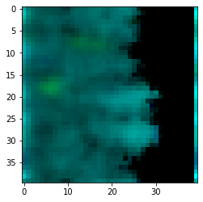

**Modeling growth and propagation of bacterial colonies on flat surfaces.**

This protocol replicates the main text protocol that simulates demographic noise which causes spatial segregation of expanding, equally-fit colonies. 


```python
import cobra
import cobra.test # for the ijo1366 model
import sys
import copy
import numpy as np
sys.path.append("/home/jeremy/Dropbox/work_related/harcombe_lab/segre/cometspy") # not necessary if you pip install cometspy
import cometspy as c
```

We will use the E. coli core model.


```python
ecoli = cobra.test.create_test_model("textbook")
```

We will now convert this into a COMETS model, and set two parameter options: the demographic noise parameter, which is called "neutral drift," and convection-based motion parameters. 


```python
grid_size = 40
ecoli_comets = c.model(ecoli)
ecoli_comets.reactions.loc[ecoli_comets.reactions.EXCH, "LB"] = -1000
ecoli_comets.add_nonlinear_diffusion_parameters(convNonlinDiffZero = 0.,
                                    convNonlinDiffN = 6.e-6,
                                    convNonlinDiffExponent = 1.0,
                                    convNonlinDiffHillN = 2.,
                                    convNonlinDiffHillK = 0.001)
ecoli_comets.add_neutral_drift_parameter(0.01)
```

    Note: for non-linear diffusion parameters to function,
    params.all_params['biomassMotionStyle'] = 'ConvNonlin' Diffusion 2D'
    must also be set


Let's make an exact copy of the ecoli comets model.


```python
import random

ecoli_comets2 = copy.copy(ecoli_comets)
ecoli_comets2.id = "e_coli_core2"

ecoli_comets.initial_pop = [[x, 0, np.random.normal(6.4e-5, 1e-6)] for x in range(grid_size)]
ecoli_comets2.initial_pop = [[x, 0, np.random.normal(6.4e-5, 1e-6)] for x in range(grid_size)]

```

This simulation will be of a single, centered colony on a 100x100 grid. carbon will be spread homogenously, and be fixed at initial concentration along one end.


```python
ly = c.layout([ecoli_comets, ecoli_comets2])
ly.grid = [grid_size, grid_size]
ly.set_specific_metabolite("glc__D_e", 2.2e-3)
ly.set_specific_metabolite("h2o_e", 1000)
ly.set_specific_metabolite("nh4_e", 1000)
ly.set_specific_metabolite("o2_e", 1000)
ly.set_specific_metabolite("pi_e", 1000)
ly.set_specific_metabolite("h_e", 1000)

for x in range(grid_size):
    ly.set_specific_static_at_location("glc__D_e", (x, grid_size-1), 1.1e-3)
    
```

The main parameter we need to set is biomassmotionstyle, which must be set to "ConvNonlin Diffusion 2D".  Then, to capture the spatial information, we'll also log biomass (instead of just total biomass). Finally, we'll also adjust a handful of other parameters. These are stored in the dictionary all_params.


```python
p = c.params()

cycles = 1000

p.all_params["biomassMotionStyle"] = "ConvNonlin Diffusion 2D"
p.all_params["writeBiomassLog"] = True
p.all_params["BiomassLogRate"] = cycles
p.all_params["maxCycles"] = cycles
p.all_params["timeStep"] = 0.05
p.all_params["spaceWidth"] = 0.01
p.all_params["defaultDiffConst"] = 6.e-6
p.all_params["maxSpaceBiomass"] = 1000000
p.all_params["minSpaceBiomass"] = 1.0e-9
p.all_params["allowCellOverlap"] = True
p.all_params["growthDiffRate"] = 0
p.all_params["defaultVmax"] = 18.5
p.all_params["defaultKm"] = 0.000015
p.all_params["defaultHill"] = 1
p.all_params["exchangestyle"] = "Monod Style"
```

Now we make a simulation object and run it.  This can take awhile.


```python
sim = c.comets(ly, p)
sim.run()
```


    Running COMETS simulation ...
    Done!


Now let's plot the results. We use the get_biomass_image helper function and then matplotlib to do the plotting.


```python
im = sim.get_biomass_image('e_coli_core', cycles).astype(float)
im = im / np.max(im)
im2 = sim.get_biomass_image('e_coli_core2',cycles).astype(float)
im2 = im2 / np.max(im2)
final = np.zeros((grid_size,grid_size,3))
final[:,:,1] = im
final[:,:,2] = im2
from matplotlib import pyplot as plt
plt.imshow(final)
```


    <matplotlib.image.AxesImage at 0x7fba555da860>





```python

```
