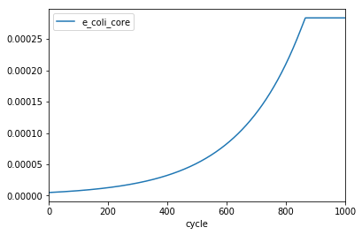

This simple example illustrates the basic workflow of COMETS, including how to
build the simulation layout, to specify parameters, load the model and plot the
data once the simulation is finished.

The core of the COMETS methodology is the Dynamic Flux Balance Analysis
algorithm (Madahevan et al 2002). One of the first successful simulations of
the time dynamics of bacterial metabolism was the classical study of
*Escherichia coli* batch culture by Varma and Palsson (1994). Here, we reproduce
one of the results in that study, the anaerobic fermentation in minimal media
with glucose as the only carbon source.

We will simulate a test tube by setting a well-mixed virtual container with
$1cm^3$ of media, which we will inoculate with $5 \times 10^{-6}$ grams of *E. coli* biomass.
We will set the initial composition of the substrate to 11mM of glucose and
unlimited amounts of ammonia and phosphate. For the nutrient uptake, we will use
standard Michaelis-Menten kinetics, using the experimentally measured Monod
parameter for anaerobic uptake of glucose by *E. coli*.

For this simple example, we use the rudimentary "core" model of E. coli
(Orth et al. 2009), which can be downloaded in .xml format from
http://bigg.ucsd.edu/models/e_coli_core, and represents an *E. coli* metabolism
simplified to its core functions (glycolysis, tricarboxylic cycle, pentose
  phosphate shunt, etc).

# Loading the COMETS Python Toolbox
We first import the COMETS Python toolbox, which will also load all the
dependencies, such as CobraPy or pandas.

```Python
import comets as c
```

# Creating a test tube
We are now ready to create a "layout" for our simulation. By instantiating the
class `layout` without arguments, we will create the default simulation layout,
represents an empty, well mixed space (called "cell") with volume 1cm^3. We can
then modify this layout according to our needs, in this case adding the media
composition in the desired concentration.

```Python
# Create empty 1x1 layout
test_tube = c.layout()

# Add 11mM glucose and remove o2
test_tube.set_specific_metabolite('glc__D_e', 0.011)
test_tube.set_specific_metabolite('o2_e', 0)

# Add the rest of nutrients unlimited (ammonia, phosphate, water and protons)
test_tube.set_specific_metabolite('nh4_e',1000);
test_tube.set_specific_metabolite('pi_e',1000);
test_tube.set_specific_metabolite('h2o_e',1000);
test_tube.set_specific_metabolite('h_e',1000);
```

[TODO does setting 1000 ensure that metabolites are static?]: #

# Loading a model
Next, we have to load the model and add it to the layout (or "inoculate it in
our test tube").

Under the hood, the comets `model` class uses the CobraPy package to load
models, and actually comets `model` class can be instantiated also with a loaded
CobraPy model as input. In our experience, this has been very useful when using
CobraPy and COMETS back and forth to perform different types of simulations and
analysis.

In this case, we load our model from the `.xml` file we downloaded.
We then remove the bounds on glucose import, which will be set dynamically by
COMETS during the simulation according to the dynamically changing external
glucose concentration. We will set the initial biomass of our model at 10-6 gr.  

```Python
# load the model
e_coli = c.model('test_models/e_coli_core.xml')
e_coli.change_bounds('EX_glc__D_e', -1000, 1000)

# set its initial biomass, 5e-6 gr at coordinate [0,0]
e_coli.initial_pop = [0, 0, 5e-6]

# add it to the test_tube
test_tube.add_model(e_coli)
```

# Setting the simulation parameters
We next instantiate the `params` class, which generates a set of parameters for
the COMETS simulation with the [TODO LINK TO DEF VALS] default values for all of them. All
of the parameters are contained in the `all_params` field which is a Python
`dict` object, making it easy to change the value of the desired parameters.

```Python

# Set the parameters that are different from the default
sim_params = c.params()
sim_params.all_params['defaultVmax'] = 18.5
sim_params.all_params['defaultKm'] = 0.000015
sim_params.all_params['maxCycles'] = 1000
sim_params.all_params['timeStep'] = 0.01
sim_params.all_params['spaceWidth'] = 1
sim_params.all_params['maxSpaceBiomass'] = 10
sim_params.all_params['minSpaceBiomass'] = 1e-11
sim_params.all_params['writeMediaLog'] = True
```

##Running the simulation
With all set up, we can now instantiate the `comets` class by passing the
`layout` (containing the `model`) and the `params` objects we just created.

```Python
well_mixed = c.comets(test_tube, sim_params)
```

Finally, we can run the simulation as:
```Python
well_mixed.run()
```

##Analyzing the results
The results of our simulation are stored in several `pandas` data frames
contained in the `comets` object that we just simulated. The growth of the
simulated model can be seen by plotting the total_biomass field.  

```Python
well_mixed.total_biomass.plot(x = 'cycle')
```



Similarly, we can plot composition of the media. In this case, we will limit
the plot to those components that are not added to the layout in unlimited
amounts (“static” compounds, e.g. ammonia, phosphate, water, etc in this
  simulation). In this case, we do this by limiting the plot to compounds with
  concentration lower than 900mM.


```Python
media = well_mixed.media.copy()
media = media[media.conc_mmol<900]

fig, ax = plt.subplots()
media.groupby('metabolite').plot(x='cycle', ax =ax, y='conc_mmol')
ax.legend(('acetate','ethanol', 'formate', 'glucose'))
```


