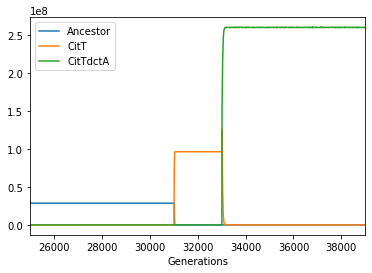

After 33,000 generations a large population expansion was observed in the
Ara-3 population of the E. coli long-term evolution experiment
(Blount et al 2008). This population expansion was found to be associated with
two key mutations that together enable the evolution of strong aerobic citrate
utilization (Cit++ phenotype). The first mutation, occurring roughly 31,000
generations, caused the aerobic expression of the citT transporter, producing
a weak citrate growth phenotype (Cit+, Blount et al 2012). A subsequent
mutation, occurring roughly 33,000 generations, caused high-level, constitutive
expression of dctA, a proton-driven dicarboxylic acid transporter
(Quandt et al 2014). Because these two mutations introduce known reactions into
the e.coli metabolic network we can simulate them using COMETS.

In this example, we illustrate how we can simulate the appearance of these two
mutations in the *E. coli* population growing under the LTEE conditions (24hr
  batch culture in DM25). For this, we will sequentially introduce the
  mutations as they appear in the population, and observe their effects in the
  context of the population in which they appear. This simulation uses the same
models, parameters and genotypes outlined in (Bajic et al 2018).

We first load the toolbox, create the layout and simulate the DM25 medium.

```Python
%matplotlib inline
import comets as c
import matplotlib as plt
import cobra
import pandas as pd
import numpy as np

layout = c.layout()

#Set up media to be DM25
flask.add_typical_trace_metabolites()
flask.set_specific_metabolite('glc__D_e', 0.000139)
flask.set_specific_metabolite('cit_e', 0.0017)
```

We next load the model and build the mutants. To show the compatibility with
the COBRApy toolbox, we will load the model and perform the mutations using
COBRA, and then pass these models as input to build COMETS models.

Unlike the LTEE ancestral strain REL606 (and *E. coli* in general), which
possess the necessary genes for citrate utilization but do not express them in
aerobic conditions, iJO1366 is able utilize both citrate and succinate as
these reactions are unbounded by default. Thus, the ancestral phenotype can
be recreated by knocking out three reactions CITt7pp (citT), SUCCt2_2pp (dctA)
and SUCCt2_3pp (dcuA or dcuB).

```Python
# Load the original E. coli model
mod  = cobra.io.read_sbml_model('test_models/iJO1366.xml')

# Set exchange reaction lower bounds to -1000 to allow them being controlled by COMETS
for i in mod.reactions:
    if 'EX_' in i.id:
        i.lower_bound =-1000.0

# Create the mutants
mod.reactions.SUCCt2_3pp.upper_bound=0.0
CitTdctA = mod.copy()
mod.reactions.SUCCt2_2pp.upper_bound =0.0
CitT = mod.copy()
mod.reactions.CITt7pp.upper_bound =0.0
WT = mod.copy()
WT.id= 'Ancestor'
CitT.id = 'Cit+'
CitTdctA.id = 'Cit++'

# Generate comets models from COBRA models and set their initial population size
# We'll introduce genotypes 100 cells at a time to avoid the risk of them going extinct through drift
p = c.model(WT)
p.initial_pop = [0, 0, 3.9e-11]
p2 = c.model(CitT)
p2.initial_pop = [0, 0, 0] # not present at start
p3 = c.model(CitTdctA)
p3.initial_pop = [0, 0, 0] # not present at start

# Add the models to the simulation
flask.add_model(p)
flask.add_model(p2)
flask.add_model(p3)
```

We now set the parameters for the simulation. We use 1 hr as the COMETS
timestep to speed up the simulation. Shortening this to the more commonly used
0.1 hr does not substantially affect the final result, but it does
significantly increase the time it takes this simulation to run.

```Python
### Setting paramaters for the simulation ###
ltee_params = c.params()
ltee_params.all_params['timeStep'] = 1.0
ltee_params.all_params['deathRate'] = 0.01
ltee_params.all_params['batchDilution'] =True
ltee_params.all_params['dilTime'] =24
ltee_params.all_params['dilFactor'] =100
ltee_params.all_params['cellSize']= 3.9e-13
ltee_params.all_params['minSpaceBiomass'] = 3.8e-13
```

Now perform the simulations. We will divide our simulation in three COMETS
runs (phase 1, 2 and 3). We will start the simulation at generation 25000 and
run for around 6000 generations. At roughly generation 31,000, we introduce the
CitT genotype and run for around 2000 Generations. Finally, at roughly
Generation 33,000 we introduce the CitTdctA Genotype and run for a final 6000
generations. For each run, we will input the final biomass composition of the
previous run. Each phase stores the biomass data in a separate separate
dataframe that we will ultimately join together for analysis.

```Python
# We'll start at Generation 25,000.  and run for around 6000 generations
cycles_per_day = 24.0/ltee_params.all_params['timeStep']
ltee_cit_simulation = c.comets(flask, ltee_params)
ltee_cit_simulation.parameters.all_params['maxCycles'] = int(900*cycles_per_day)
ltee_cit_simulation.run()

ltee_cit_simulation = c.comets(flask, ltee_params)
ltee_cit_simulation.parameters.all_params['maxCycles'] = int(900*cycles_per_day)
phase_1 = pd.DataFrame({'Ancestor' : ltee_cit_simulation.total_biomass.Ancestor/(3.9e-13),
                        'CitT' : ltee_cit_simulation.total_biomass['Cit+']/(3.9e-13),
                        'CitTdctA' : ltee_cit_simulation.total_biomass['Cit++']/(3.9e-13),
                        'Generations' : 6.67*(ltee_cit_simulation.total_biomass.cycle+1)/cycles_per_day + 25000})

# At roughly Generation 31,000 we introduce the CitT genotype and run for around 2000 Generations
ltee_cit_simulation.flask.models[0].initial_pop = [0, 0, float(ltee_cit_simulation.total_biomass.Ancestor.tail(1))]
ltee_cit_simulation.flask.models[1].initial_pop = [0, 0, 3.9e-11]
ltee_cit_simulation.flask.build_initial_pop()
ltee_cit_simulation.parameters.all_params['maxCycles'] = int(300*cycles_per_day)
ltee_cit_simulation.run()
phase_2 = pd.DataFrame({'Ancestor' : ltee_cit_simulation.total_biomass.Ancestor/(3.9e-13),
                        'CitT' : ltee_cit_simulation.total_biomass['Cit+']/(3.9e-13),
                        'CitTdctA' : ltee_cit_simulation.total_biomass['Cit++']/(3.9e-13),
                        'Generations' : 6.67*(ltee_cit_simulation.total_biomass.cycle)/cycles_per_day + max(phase_1.Generations)})

# At roughly Generation 33,000 we introduce the CitTdctA Genotype and run for a final 6000 generationr
ltee_cit_simulation.flask.models[0].initial_pop = [0, 0, float(ltee_cit_simulation.total_biomass.Ancestor.tail(1))]
ltee_cit_simulation.flask.models[1].initial_pop = [0, 0, float(ltee_cit_simulation.total_biomass['Cit+'].tail(1))]
ltee_cit_simulation.flask.models[2].initial_pop = [0, 0, 3.9e-11]
ltee_cit_simulation.flask.build_initial_pop()
ltee_cit_simulation.parameters.all_params['maxCycles'] = int(900*cycles_per_day)
ltee_cit_simulation.run()
phase_3 = pd.DataFrame({'Ancestor' : ltee_cit_simulation.total_biomass.Ancestor/(3.9e-13),
                        'CitT' : ltee_cit_simulation.total_biomass['Cit+']/(3.9e-13),
                        'CitTdctA' : ltee_cit_simulation.total_biomass['Cit++']/(3.9e-13),
                        'Generations' : 6.67*(ltee_cit_simulation.total_biomass.cycle)/cycles_per_day + max(phase_2.Generations) })
```

Finally, group all the results from the three runs together and plot the
stationary phase population size through time.

```python
#Remove the final time point from each phase
phase_1.drop(phase_1.tail(1).index, inplace=True)
phase_2.drop(phase_2.tail(1).index, inplace=True)
phase_3.drop(phase_3.tail(1).index, inplace=True)

final_df = pd.concat([phase_1,phase_2,phase_3])
final_df.reindex()
final_df = final_df[np.round((final_df.Generations - 25000) % 6.67,3) == 6.67]
final_df.plot(x='Generations', ylog=True)
```



