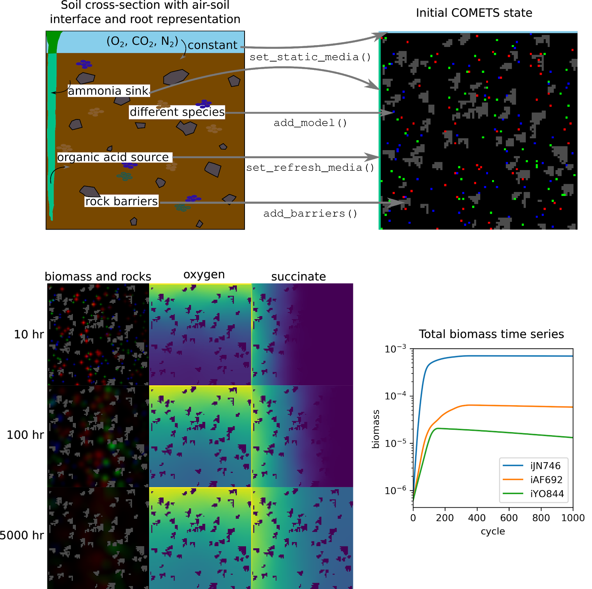

One can make a complex, realistic environment in COMETS with relative simplicity. Here, we demonstrate how to simulate a 2d cross-section of soil with three different species, a “root” along the left side, “air” along the top, and multiple impenetrable rocks.

We begin by downloading three soil bacteria models as .xml files from the BiGG database (King et al. 2015): the Bacillus subtilis model iYO844, the Pseudomonas putida model iJN747, and the Methanosarcina barkeri model iAF629. We load these models into a python environment using the Cobra toolbox. Also, upon downloading, the biomass functions of these models had positive lower bounds, which we then set to zero:

```Py
import cobra
import comets as c

iJN = cobra.io.read_sbml_model('iJN746.xml')
iJN.reactions.get_by_id('BIOMASS_KT_TEMP').lower_bound = 0
iJN.reactions.get_by_id('BIOMASS_KT_TEMP').upper_bound = 1000

iAF = cobra.io.read_sbml_model('iAF692.xml')
iAF.reactions.get_by_id('BIOMASS_Mb_30').lower_bound = 0
iAF.reactions.get_by_id('BIOMASS_Mb_30').upper_bound = 1000

iYO = cobra.io.read_sbml_model('iYO844.xml')
iYO.reactions.get_by_id('BIOMASS_BS_10').lower_bound = 0
iYO.reactions.get_by_id('BIOMASS_BS_10').upper_bound = 1000
```

Next, we convert these into COMETS models. (Side note: A difficult design choice was made in having a specific COMETS model object, rather than just using a Cobra object. The reason we used a separate COMETS model object was because in Cobra, media environments are an intrinsic part of the Cobra model, and are generated by altering flux bounds on exchange reactions. In COMETS, assuming the model is a wild-type, the exchange reaction flux bounds should always be open, and the media environment is not part of the model, but part of the layout. Our intent in making a specific COMETS model object was to hopefully reduce the chance that Cobra users would attempt to set the media environment by making changes to the COMETS model. ) We also ensure the model does not think that sink reactions are exchange reactions (as they are unbalanced in Cobra models, and therefore appear similar to exchanges), and open all exchange reaction bounds:

```Py
iJN_comets = c.model(iJN)
iJN_comets = ensure_sinks_are_not_exchanges(iJN_comets) # note to self, make these model-owner methods
iJN_comets = open_exchanges(iJN_comets)

iAF_comets = c.model(iAF)
iAF_comets = ensure_sinks_are_not_exchanges(iAF_comets)
iAF_comets = open_exchanges(iAF_comets)

iYO_comets = c.model(iYO)
iYO_comets = ensure_sinks_are_not_exchanges(iYO_comets)
iYO_comets = open_exchanges(iYO_comets)
```

Our simulated world will be a 100x100 box lattice. The left-hand side, where x = 0, will be the root. The top, where y = 0, will be the air. Therefore, the biomass and the rocks will be distributed everywhere else. To ensure that we don't attempt to place biomass where rocks are placed, we first determine the rock locations. Specifically, we will create 70 rocks which are impervious to any biomass or metabolite. These rocks will have an average size of 15 boxes. To pick these locations, we use the helper function grow_rocks:

```Py
rock_locs = grow_rocks(n = 70, xrange = [1,100],yrange = [1,100],mean_size = 15)
```

Each species will have biomass seeded at 60 different locations, with no overlap. We will use the helper function pick_random_locations for this, which is useful as it can take in a previously-generated list of tuples of x-y locations as “forbidden” locations, such as the rock locations.

First we make a copy of the rock_locs so we don't accidentally alter it, and call this copy forbidden_locs.

```Py
import copy
forbidden_locs = copy.deepcopy(rock_locs)
```

Next we pick the random locations for each species, adding these locations to the forbidden locs as we go so as to prevent overlap.

```Py
iJN_locs = pick_random_locations(n = 60, xrange = [1,100], yrange = [1,100], forbidden_locs = forbidden_locs)
forbidden_locs.extend(iJN_locs)
iYO_locs = pick_random_locations(60, [1,100],[1,100], forbidden_locs)
forbidden_locs.extend(iYO_locs)
iAF_locs = pick_random_locations(60, [1,100],[1,100], forbidden_locs)
forbidden_locs.extend(iAF_locs)
# note to self:  put this somewhere logical in the toolbox
```
If we wish to take a look at what locations were chosen, we can easily make an image with matplotlib (see Figure XXX):

```Py
from matplotlib import pyplot as plt
initial_image = np.zeros((100,100,3))
for rock in rock_locs:
    initial_image[rock[1]-1,rock[0]-1,0:3] = 0.5 
for loc in iJN_locs:
	initial_image[loc[1]-1,loc[0]-1,0] = 1
for loc in iYO_locs:
	initial_image[loc[1]-1,loc[0]-1,1] = 1
for loc in iAF_locs:
	initial_image[loc[1]-1,loc[0]-1,2] = 1
plt.imshow(initial_image)
	```

Things look good so we continue by making the layout and setting the dimensions. Then, we add the rock barriers to the layout.

```Py
layout = c.layout()
layout.grid = [100,100]
layout.add_barriers(rock_locs)
```
We set the initial population for each species by using a python list comprehension. Note that locations are properties of the model (NOTE maybe I should change this to layout, and make it something like layout.set_initial_pop(species_id, locs, biomass).
```Py
iJN_comets.initial_pop = [[loc[0],loc[1],1e-8] for loc in iJN_locs]
iYO_comets.initial_pop = [[loc[0],loc[1],1e-8] for loc in iYO_locs]
iAF_comets.initial_pop = [[loc[0],loc[1],1e-8] for loc in iAF_locs]
```
We add the models to the layout.
```Py
layout.add_model(iJN_comets)
layout.add_model(iYO_comets)
layout.add_model(iAF_comets)
```
We want some metabolites available initially. These include all the typical trace nutrients needed, so we start with the helper function.

```Py
layout.add_typical_trace_metabolites()
```				

However, we want oxygen to mostly diffuse from the air, so we set that value lower. We also add a few other trace metabolites homogeneously throughout the environm
At this point we make a COMETS instance and run the model. Be aware that on a modern mid-range computer, this could take more than 5 hours. Set the parameter 'maxCycles' to something smaller if you wish to conduct a test. Note that we set delete_files = False. If one is running fast simulations such as in a single box, it is convenient to leave this as true to keep the file structure clean. However, for long-running simulations, it makes more sense to keep file records of the simulation settings and data, in case the python kernel is shutdown.
spatial = c.comets(layout, params)
spatial.run(delete_files = False) # takes hours!

(todo: decide whether we want the python toolbox to read total biomass / biomass / media files, or whether we state that that is “a typical python task” and leave it up to the reader. I have functions which parse the data out of the MATLAB results which used to be spit out of the comets runs (which is what I'm still doing, heh), but I haven't written anything for whatever the new format is)

Once complete, the location-specific biomass and media information are in files which are specified in the params, as is the summarized total biomass data:

```Py
params.all_params['BiomassLogName']
params.all_params['MediaLogName']
params.all_params['TotalBiomassLogName']
```

These files can be easily parsed with your favorite data analysis tool. For the figures below, we loaded the data into numpy arrays and visualized them with matplotlib functions, as in previous protocols. 



